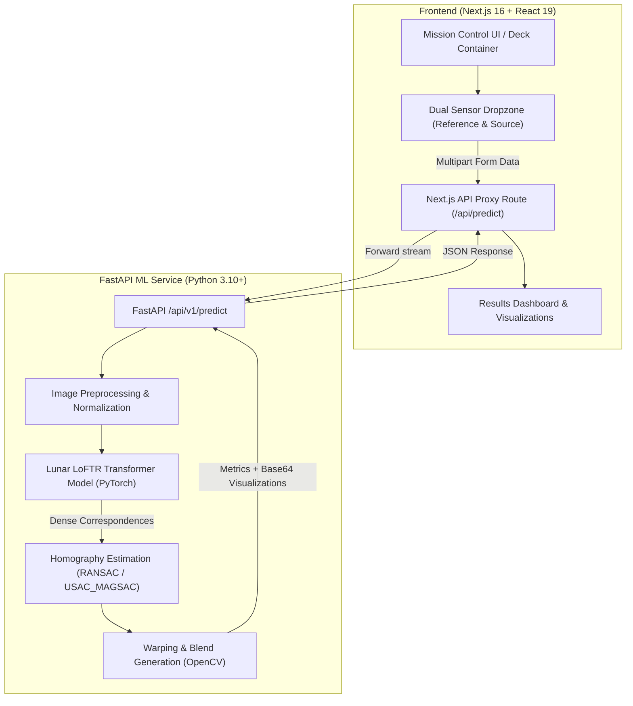

# 🛰️ Cosmic Vision — Lunar Image Correspondence & Registration Platform

[](https://www.sih.gov.in/)
[](https://www.isro.gov.in/)
[](https://nextjs.org/)
[](https://react.dev/)
[](https://tailwindcss.com/)
[](http://3.109.52.22:3000/)
[](https://www.docker.com/)

> **SIH 2026 — Problem Statement SIH26166**  
> **Organization:** Indian Space Research Organisation (ISRO)  
> **Theme:** Space Technology | Multi-modal, Sun Angle, and Scale Invariant Image Correspondence using Chandrayaan-2 Optical Images  
> 
> 🌐 **Live Deployed Application:** [http://3.109.52.22:3000/](http://3.109.52.22:3000/)

---

## 🌌 Overview

**Cosmic Vision** is a mission-grade web platform and high-resolution computer vision dashboard engineered for the **Indian Space Research Organisation (ISRO)**. It solves the critical lunar mapping challenge of **cross-mission lunar image registration** — discovering point-to-point correspondences and computing geometric transformations to seamlessly align multi-temporal, multi-sensor, and multi-scale orbital imagery into a unified coordinate frame.

The platform processes optical images captured by Chandrayaan-2 payloads and aligns them with global benchmark reference images (such as NASA's **LRO NAC** and JAXA's **SELENE/Kaguya**).

### 🎯 Core Challenges Solved
- **Illumination Invariance:** Matches identical lunar terrain under radically varying solar elevation and azimuth angles that produce long shadows and inverted contrast.
- **Scale & Resolution Invariance:** Bridges large spatial resolution differences (e.g., OHRC at sub-meter ~0.25 m vs. TMC-2 at ~5 m vs. LRO NAC).
- **Viewpoint & Perspective Distortions:** Corrects non-nadir oblique angles and spacecraft tilt via robust RANSAC-based homography matrix computation.
- **Sub-Pixel Precision:** Ensures match accuracy down to sub-pixel coordinates while guaranteeing uniform spatial distribution across cratered surfaces.

---

## 🔭 Supported Optical Payloads

| Payload | Mission / Agency | Resolution / Band | Purpose in Pipeline |
|---|---|---|---|
| **OHRC** (Orbiter High Resolution Camera) | Chandrayaan-2 (ISRO) | ~0.25 m/pixel | High-resolution source / moving image |
| **TMC-2** (Terrain Mapping Camera-2) | Chandrayaan-2 (ISRO) | ~5.0 m/pixel (Stereo) | 3D Digital Elevation Models (DEM) & regional mapping |
| **IIRS** (Imaging Infrared Spectrometer) | Chandrayaan-2 (ISRO) | 0.8 – 5.0 µm | Mineralogy & multi-spectral correspondence |
| **LRO NAC** (Narrow Angle Camera) | LRO (NASA) | ~0.5 – 1.0 m/pixel | Canonical reference target |
| **SELENE / TC** (Terrain Camera) | SELENE / Kaguya (JAXA) | ~10 m/pixel | Global reference target |

---

## ✨ Key Features

- **🚀 Interactive Mission Deck & Presentation Interface:**
  - Built-in cinematic slide presentation and interactive flight scanners with physics simulations (Matter.js & GSAP).
  - Ambient mission audio player (BGM toggle), slide curtain transitions, floating satellite telemetry widgets, and real-time status monitors.
- **⚡ Two-Click Registration Workspace:**
  - Drag-and-drop dual upload zones for Reference (Target) and Source (Moving) imagery with instant preview, metadata inspection, and sensor auto-tagging.
- **🤖 Deep Learning LoFTR Integration:**
  - Connected with fine-tuned **LoFTR (Local Feature TRansformer)** (`best_lunar_loftr.pt`, Hugging Face: `VashuTheGreat2/lunar-loftr-registration`) for dense, detector-free feature correspondence.
- **📊 Scientific Metrics Dashboard:**
  - Real-time computation of **Total Matches**, **RANSAC Inliers**, **Inlier Ratio (%)**, and reprojection **RMSE (pixels)**.
  - Interactive **3×3 Homography Matrix** inspector with perspective transformation validation.
- **🔍 Comprehensive Visualizations & Lightbox:**
  - **50/50 Registered Blend:** Alpha-blended composite overlay of warped source over reference.
  - **Correspondence Match Lines:** Side-by-side tie-point vector visualization with confidence coloring.
  - **Warped Source:** Geometrically reprojected source image matching reference geometry.
  - **Keypoint Distribution Maps:** Sub-pixel reference and source scatter plots showing spatial uniformity.
  - Built-in zoom/pan lightbox modal for close-up crater inspection.
- **💾 One-Click Export:**
  - Download individual visual outputs or export complete scientific registration packages (`.jpg`, `.png`, and structured correspondence JSON).

---

## 🏗️ System Architecture



---

## 🛠️ Tech Stack

### Frontend
- **Framework:** [Next.js 16.3.4](https://nextjs.org/) (App Router, Server Components & Route Handlers)
- **Library:** [React 19.2.8](https://react.dev/)
- **Styling:** [Tailwind CSS v4](https://tailwindcss.com/) with custom space-age dark theme
- **Animations & Physics:** [GSAP 3.15](https://greensock.com/gsap/) & [Matter.js 0.20](https://brm.io/matter-js/)
- **Icons & Feedback:** [Lucide React](https://lucide.dev/) & [Sonner](https://sonner.emilkowal.ski/)
- **Type Safety:** [TypeScript 5](https://www.typescriptlang.org/)

### Backend / ML Integration (External Service)
- **API Framework:** FastAPI / Uvicorn
- **ML / CV Core:** PyTorch, TorchVision, LoFTR (Local Feature TRansformer), OpenCV (`cv2`), Albumentations, NumPy
- **Model Checkpoint:** Fine-tuned Lunar LoFTR on Hugging Face (`VashuTheGreat2/lunar-loftr-registration`)

---

## 📁 Directory Structure

```text
client/
├── .env.example              # Sample environment configuration
├── .env.local                # Local environment secrets (not in git)
├── docker-compose.yml        # Multi-container deployment specification
├── Dockerfile                # Production multi-stage Docker build
├── package.json              # Project dependencies & npm scripts
├── tsconfig.json             # TypeScript compiler configuration
├── PRD/                      # Complete Product Requirements Document (PRD.md)
├── TASK/                     # Task tracking and execution checklists
├── public/                   # Static assets, lunar textures, sample images
├── src/
│   ├── app/
│   │   ├── layout.tsx        # Root layout with fonts & notification providers
│   │   ├── page.tsx          # Main entry (interactive presentation deck & tool)
│   │   ├── globals.css       # Global space-grade styles & Tailwind v4 theme
│   │   ├── results/          # Full-page registration analysis & metrics view
│   │   ├── references/       # Scientific reference datasets & mission bibliography
│   │   ├── about/            # Team and project mission info
│   │   └── api/
│   │       └── predict/      # Server-side Next.js route proxying to FastAPI backend
│   ├── components/
│   │   ├── common/           # Reusable UI elements (Button, Badge, Lightbox, etc.)
│   │   ├── deck/             # Interactive slide deck engine & presentation slides
│   │   │   ├── slides/       # Problem, Architecture, Sensors, Scanner, Results slides
│   │   │   ├── DeckContainer.tsx
│   │   │   └── FloatingSatellite.tsx
│   │   ├── layout/           # Header, Footer, PageLayout navigation
│   │   ├── results/          # Metric cards, homography display, visualization grid
│   │   └── upload/           # Dual-image drag-and-drop file uploaders
│   ├── context/              # React Context (PredictionContext) for state management
│   ├── hooks/                # Custom React hooks (audio, animation, keyboard nav)
│   ├── services/             # Prediction client service (predictionService.ts)
│   ├── types/                # TypeScript interfaces (prediction.ts, deck.ts)
│   └── utils/                # Matrix math, file validators, metric calculation helpers
```

---

## 🚀 Getting Started

### 🌐 Live Deployment
The client application is live and accessible at:  
👉 **[http://3.109.52.22:3000/](http://3.109.52.22:3000/)**

---

### Prerequisites
- **Node.js:** v20.x or later
- **Package Manager:** `npm`, `pnpm`, `yarn`, or `bun`
- **FastAPI ML Backend:** Running locally or on a remote server (default: `http://localhost:8000`)

---

### Installation & Local Setup

1. **Clone the repository:**
   ```bash
   git clone https://github.com/your-org/cosmic-vision.git
   cd cosmic-vision/client
   ```

2. **Install dependencies:**
   ```bash
   npm install
   # or
   pnpm install
   ```

3. **Configure Environment Variables:**
   Copy the `.env.example` file to `.env.local`:
   ```bash
   cp .env.example .env.local
   ```
   Edit `.env.local`:
   ```env
   # FastAPI ML Backend URL (Proxied server-side by Next.js; do not expose with NEXT_PUBLIC_)
   FASTAPI_BASE_URL=http://localhost:8000
   ```

4. **Start the development server:**
   ```bash
   npm run dev
   ```
   Open [http://localhost:3000](http://localhost:3000) in your browser.

5. **Build for production:**
   ```bash
   npm run build
   npm run start
   ```

---

## 🐳 Docker Deployment

The application includes an optimized multi-stage `Dockerfile` and `docker-compose.yml`.

### Using Docker Compose (Recommended)

```bash
docker compose up -d --build
```
The application will be accessible at [http://localhost:3000](http://localhost:3000).

To stop the container:
```bash
docker compose down
```

### Using Docker CLI Manually

```bash
# 1. Build the production image
docker build -t cosmic-vision-client .

# 2. Run the container connecting to host FastAPI backend
docker run -d \
  --name cosmic-vision-client \
  -p 3000:3000 \
  -e FASTAPI_BASE_URL="http://host.docker.internal:8000" \
  cosmic-vision-client
```

---

## 🔌 API Integration & Data Contract

The Next.js client exposes a proxy route at `/api/predict` that forwards multipart form data to the ML inference backend at `${FASTAPI_BASE_URL}/api/v1/predict`.

### Request (Multipart Form Data)
| Field | Type | Description |
|---|---|---|
| `ref_img` (or `image1`) | `File` (Binary) | Reference image (e.g., LRO NAC or SELENE) |
| `src_img` (or `image2`) | `File` (Binary) | Moving image (e.g., Chandrayaan-2 OHRC/TMC-2) |

### Response Schema (`PredictResponse`)
```json
{
  "status": "success",
  "metrics": {
    "total_matches": 1420,
    "inliers_count": 1184,
    "rmse": 0.42
  },
  "homography": [
    [0.987, -0.012, 14.2],
    [0.011, 0.992, -8.6],
    [0.00001, -0.00002, 1.0]
  ],
  "keypoints": {
    "reference": [[120.4, 340.2], [450.8, 112.5]],
    "source": [[118.1, 348.9], [449.0, 120.1]],
    "confidence": [0.94, 0.88],
    "inlier_mask": [true, true]
  },
  "visualizations": {
    "ref_points": "data:image/jpeg;base64,...",
    "src_points": "data:image/jpeg;base64,...",
    "match_lines": "data:image/jpeg;base64,...",
    "warped_source": "data:image/jpeg;base64,...",
    "registered_overlay": "data:image/jpeg;base64,..."
  }
}
```

---

## 📈 Quality Assessment Criteria

The client evaluates registration reliability into four operational states:

| Quality Tier | Inlier Ratio | Inliers Count | Homography Condition | Status Description |
|---|---|---|---|---|
| 🟢 **Good** | $\ge 60\%$ | $\ge 50$ | Valid invertibility | High-fidelity scientific registration |
| 🟡 **Fair** | $30\% - 59\%$ | $20 - 49$ | Valid invertibility | Moderate alignment; review keypoints |
| 🟠 **Poor** | $< 30\%$ | $< 20$ | Valid or Degenerate | Low confidence match; potential false positives |
| 🔴 **Failed** | $0\%$ | $< 4$ | Null / Singular | Registration rejected; insufficient tie points |

---

## 📚 Scientific References & Data Sources

- **Chandrayaan-2 ISSDC Map Browse:** [chmapbrowse.issdc.gov.in](https://chmapbrowse.issdc.gov.in/)
- **LROC Quickmap & Downloads:** [quickmap.lroc.im-ldi.com](https://quickmap.lroc.im-ldi.com/)
- **LoFTR Research:** *Sun et al., "LoFTR: Detector-Free Local Feature Matching with Transformers", CVPR 2021.*
- **Pretrained Lunar Weights:** Hugging Face [`VashuTheGreat2/lunar-loftr-registration`](https://huggingface.co/VashuTheGreat2/lunar-loftr-registration)

---

## 👥 Authors & Acknowledgements

Developed for **Smart India Hackathon 2026** under Problem Statement **SIH26166** issued by the **Indian Space Research Organisation (ISRO)**, Department of Space.

Special thanks to the ISRO mission teams and lunar scientists working on the Chandrayaan-2 payloads for inspiring this solution.
